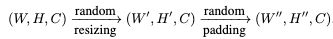

# Robust Federated Learning Against Adversarial Attacks for Speech Emotion Recognition:
The goal of this work is robust speech emotion recognition, using Federated Learning for privacy preservation, Adversarial Training for defense against white-box attacks & adding randomization at the inference time as a second stage of deffense against white-box attacks. The whitebox attacks used in this work are: 
- DeepFool 
- PGD
- FGSM

 Our proposed workflow is as follows: 
- Extracting Log Mel spectrograms from audio data
- Each speaker in the dataset is a FL client
- perform local Adversarial Training for each FL client, after the generation of the adversarial data at the beginning of each FL round
- Once the FL training is complete, add randomisation layer on the test data at inference time
- Classify the randomised test data


Our paper reference: 
```
@article{chang2022robust,
  title={Robust Federated Learning Against Adversarial Attacks for Speech Emotion Recognition},
  author={Chang, Yi and Laridi, Sofiane and Ren, Zhao and Palmer, Gregory and Schuller, Bj{\"o}rn W and Fisichella, Marco},
  journal={arXiv preprint arXiv:2203.04696},
  year={2022}
}
```

# Implementation:

## Extract log Mel spectrograms:
```
python experimentierfeld/src/data/features.py
```
## Data split:
```
python experimentierfeld/src/data/pickle_demos.py
```

## Adjust the FL configuration:
In order to change the FL configuration and the model parameters, open the config JSON file ```config.fl.json``` where you can overwrite the existing configuration.  


## Start FL:

1. cd into src/federated

2. build the Docker images:
```
sh build_server.sh && sh build_client.sh
```
3. run the server container in a new terminal:
```
sh start_server.sh
```
4. open another terminal, and run the client containers, and specify the number of clients (get num_clients from the config file):
```
sh start_fl -c 3
```

5. check if the client containers are running by the commend:
```
docker ps
```

6. choose one docker container ID of the client containers, and attach to its terminal output to check the training status:
```
docker attach <container-id>
```

7. when the training is done, the model is saved under "src/federated/results/"


## Add randomisation:
Randomisation is applied during inference time to fight against the adversarial attacks and it is composed of random resizing and random paddding as follows. 



